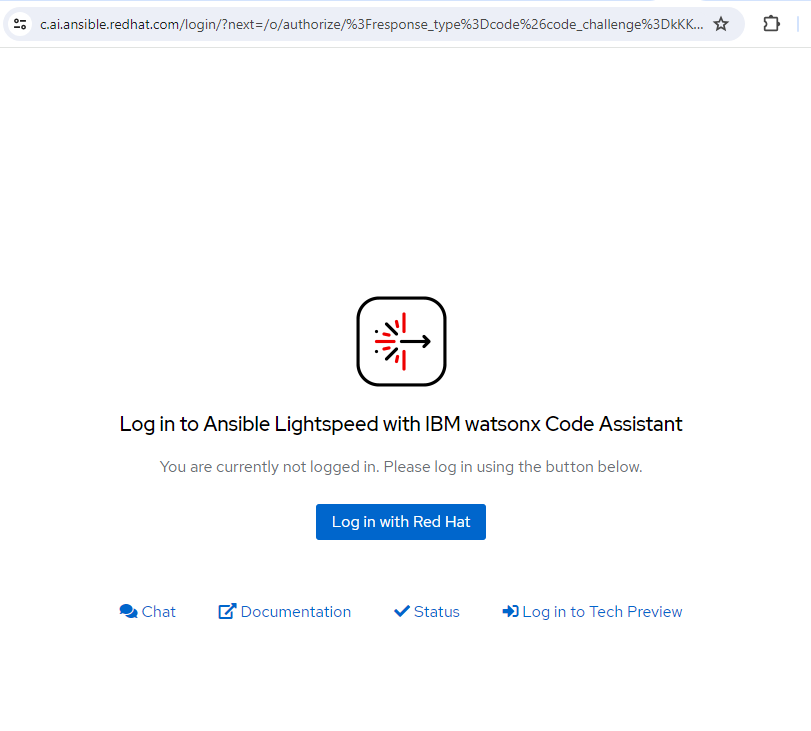
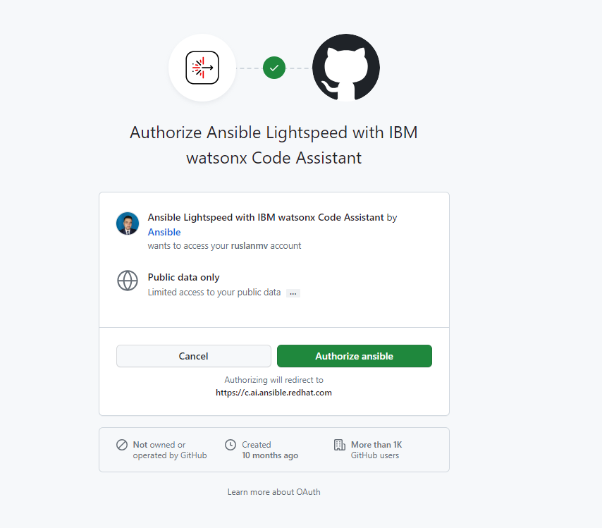
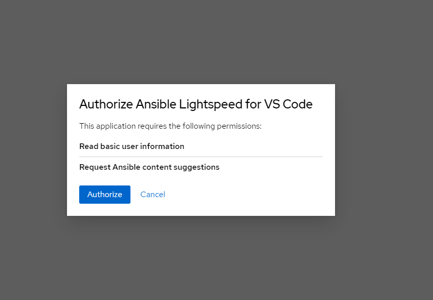

# Installing the Ansible VS Code extension

You need the latest version of the Ansible VS Code extension to access Ansible Lightspeed with IBM watsonx Code Assistant functionality.

## Prerequisites

* [VS Code][vs-code] or a [supported derivative](../faq/index.md#what-derivatives-of-vs-code-are-supported).
* Minimum version 1.70.1.

## Extension installation

1. Open VS Code.

    ```bash
    code .
    ```

2. Click the **Extensions** icon on the left sidebar.
3. Search for **Ansible** in the search box.
4. Click the **Ansible**  language support extension that is published by Red Hat.
5. Click **Install** to install the extension.

To verify your installation:

1. Create a new YAML file using the “.yml” or “.yaml” file extension.
2. Associate the Ansible language type with the new YAML file by clicking on the language
indicator - which is located on the right hand of the Status Bar, and selecting Ansible
from the dropdown.
3. Start writing a test playbook. You should see contextual aids as you create your content.

## Configuring the Ansible VS Code extension

To configure the Ansible VS Code extension for Ansible Lightspeed with IBM watsonx Code Assistant:

1. Open VS Code.

    ```bash
    code .
    ```

2. Click **File>Preferences>Settings**.
3. In the Search settings bar, type `lightspeed`.
4. Check all of the following boxes if they are not already selected:
    1. **Ansible>Lightspeed**: Enabled.
    2. **Ansible>Lightspeed>Suggestions**: Enabled.
5. In **Ansible>Lightspeed: Base Path**, enter the following: [https://c.ai.ansible.redhat.com/][base-path] [^1]
6. Close the **Settings** tab.

## Logging In to Ansible Lightspeed

1. Open the **Ansible** extension icon on the left-hand side of the Visual Studio Code interface and click **Connect**.
2. Follow the prompts to sign in to Ansible Lightspeed with IBM watsonx Code Assistant using your GitHub credentials.[^2]
   
3. Carefully review the Terms and **Agree** or **Disagree**. If you click Disagree, you will not be able to complete the login. Lastly, follow the prompt to allow VS Code to interact with Ansible Lightspeed with IBM watsonx Code Assistant on your behalf.
4. Upon successful completion of the login flow, you should see a “Logged in as \<your GitHub id\>” message in the Ansible side bar.

## Logging Out of Ansible Lightspeed

To logout of Ansible Lightspeed, follow these steps:

1. Click on the "person" icon in the bottom-left panel of the VS Code window.  This icon will have a list of accounts that VS Code is logged into.  
2. Click "Ansible Lightspeed", then "Sign Out" to logout of the service.
3. Open your browser.
4. Navigate to [https://c.ai.ansible.redhat.com/][base-path].
5. Click "Log out".




These steps in both VS Code and your web browser will ensure that you are completely logged out of Ansible Lightspeed.

You may log back into the service at any time.

[^1]: All communication to the Ansible Lightspeed service happens over HTTPS and is encrypted in-transit.
[^2]: Ansible Lightspeed currently supports public github.com accounts. Enterprise GitHub accounts will not be able to login to the service.

[vs-code]: https://code.visualstudio.com/
[base-path]: https://c.ai.ansible.redhat.com/

PYTHON DRIVERS
The Ansible Lightspeed extension for VS Code requires that Python 3.11.5 be activated as part of the workspace. Look for a Python tile adjacent to the Ansible tile along the bottom-right corner of the VS Code interface. If it is not set, click the tile and select Python 3.11.5 64-bit.

Click the gold-colored Select python environment button at the bottom-right of the interface.


From the console at the top of the VS Code environment, select the recommended Python 3.11.5 64-bit option and hit Return to confirm.


Inspect the bottom-right of the interface again to confirm that the Python library has been set.


If you continue to receive errors messages about Ansible-lint is not available or Command failed: ... you can safely ignore those warnings. Click the X icon next to the pop-up to dismiss the messages.


 
## Step 1: Set up a Python Virtual Environment
First, open a terminal or command prompt and navigate to the directory where you want to create your project. Then, create a virtual environment to isolate the project dependencies.

For macOS and Linux:
```
python3 -m .venv .venv
```
then
```
source .venv/bin/activate
```
For Windows:
```
python -m venv .venv
```
then
```
.venv\Scripts\activate
```

then

```
pip install ansible-creator

```