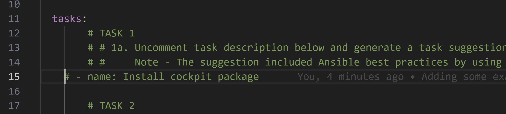
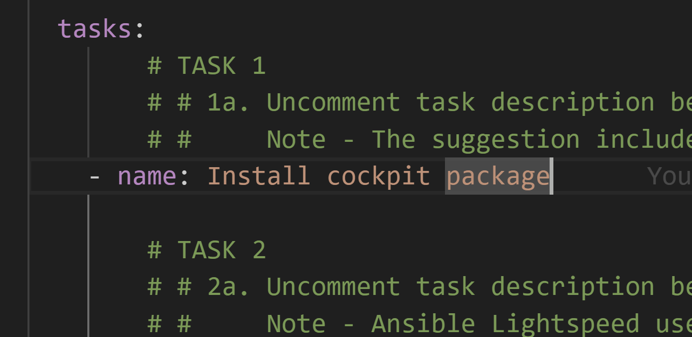
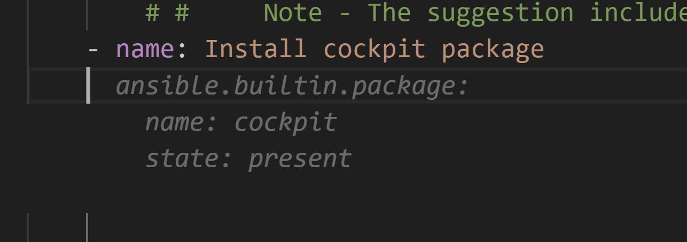
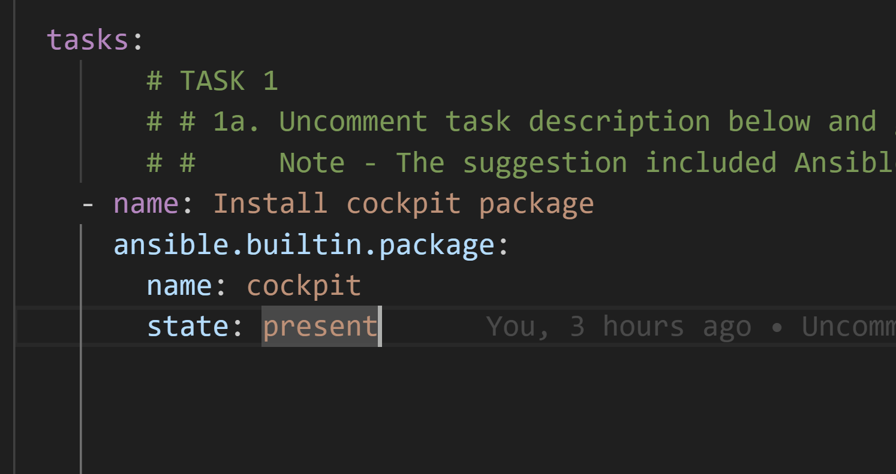

## Generating Code with IBM watsonx Code Assistant for Red Hat Ansible Lightspeed

In the following section, we will experiment with three of the key capabilities of IBM watsonx Code Assistant for Red Hat Ansible Lightspeed (WCA):

- AI-generated code recommendations
- Content source matching and source attribution
- Post-processing of AI-generated code for adherence to best practices

Testing Installation Environment

First go to the following demo file yaml [here](./playbooks/infra/install_cockpit/demo_install_cockpit.yml)

Go to the line 15

and uncomment the code, you can use

`Ctrl+K+U` will uncomment the code.

When you're going through your code and you want to examine the code in the method you're calling,  If you want to quickly comment one or more lines of code, you can press `Ctrl + K, C`

Then go to the last word of this line

and click `enter`

then will WatsonX.ai will generate those lines of code

to accept this suggesiton press tab

We un comment the all the tasks
then we go the last word of the task and we press enter
then we wait and then press tab , and this code was generated by AI.